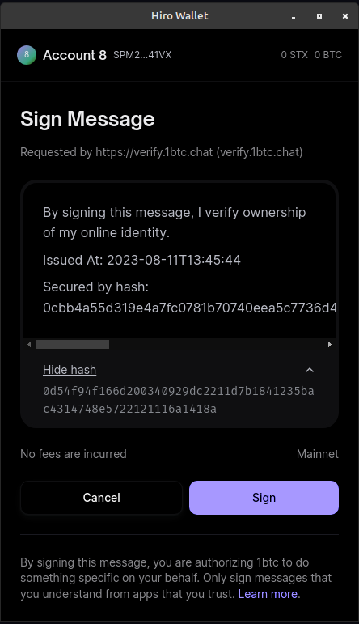

# Sign Message

In order to associate the logged in wallet with the wallet being used to hold more than 1 BTC, a cryptographic signature is used to generate a unique Bitcoin address.

The message being signed comes from the [1btc Chat API](../1btc-chat-api.md#request-message) and the signature process is handled directly by the wallet software.

### Hiro Example

<figure><figcaption></figcaption></figure>

### Xverse Example

<figure><figcaption></figcaption></figure>
